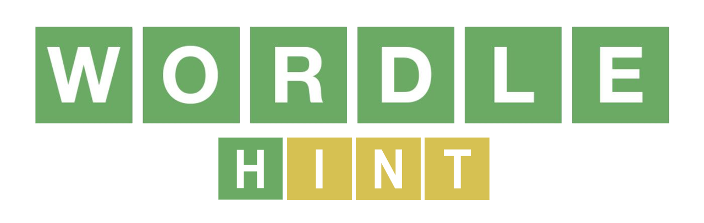
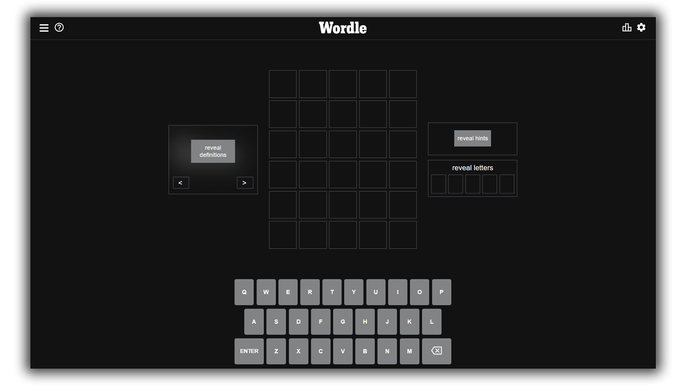
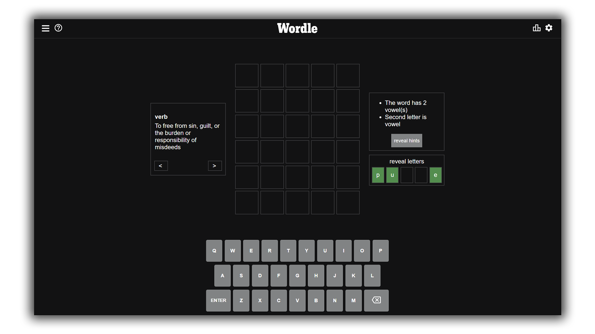

<!-- <a href=""> -->

<!-- </a> -->

## What is Wordle Hint?

Wordle Hint is a browser extension which gives hints for daily [wordle](https://www.nytimes.com/games/wordle/index.html) problem without making it too easy.

#### Hints includes 

- vowel count
- vowel position
- single letter reveal
- word definition.

## Screenshots

## Install

<!--  -->

## Usage

- Left Section - This gives us all the definition of the wordle from [this](https://dictionaryapi.dev/) API. You can change definition using left and right arrow button.

- Right Section - The upper part gives us the hints related to vowels. You can make them appear by clicking "reveal hints" button. The bottom part shows you the correct letter on the box when you click on it.
